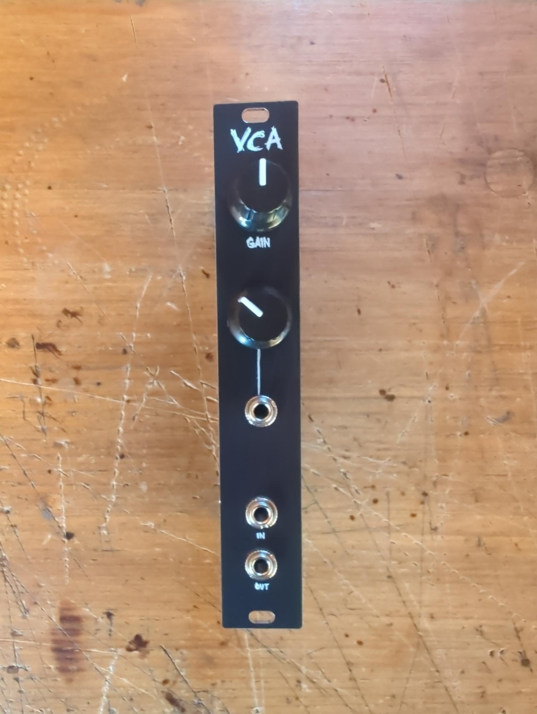
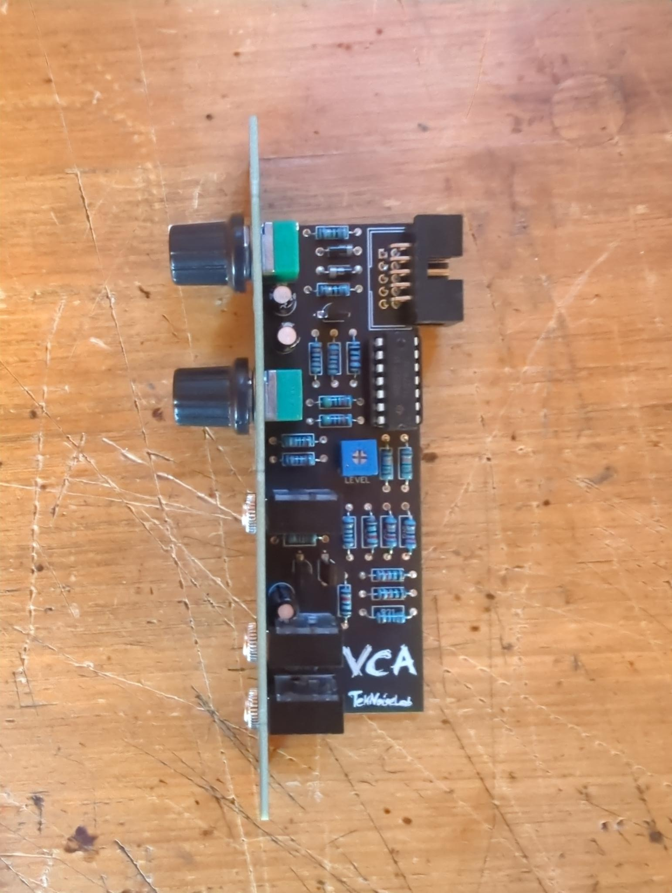

# VCA
This is a basic VCA (Voltage Controlled Amplifier/Attenuator) in 4HP for audio signals, inspired by yusynth's simple VCA design.

Nothing fancy, just a simple VCA with a CV input, CV attenuator, and a manual gain control.

When no CV is applied, the manual gain control behaves as follows:
- If set to its middle position, the VCA will pass the audio signal through without amplification or attenuation
- If set to the left, the audio signal will be attenuated
- If set to the right, the audio signal will be amplified about 2x

When CV is applied (negative or positive voltage), the audio signal will be additionally amplified or attenuated depending on the CV voltage and the CV attenuator setting.

# Build
- Order the PCBs from the PCB manufacturer of your choice.
- Order the components from your favorite electronics supplier.
- Solder the components to the PCB and mount the panel.
- After soldering the components, you have to calibrate the VCA by adjusting the trimmer on the PCB. Just set the gain control to its middle position (and do not apply any CV) and apply an audio signal. The VCA should pass the audio signal through without amplification or attenuation. If it does not, adjust the trimmer until it does.

